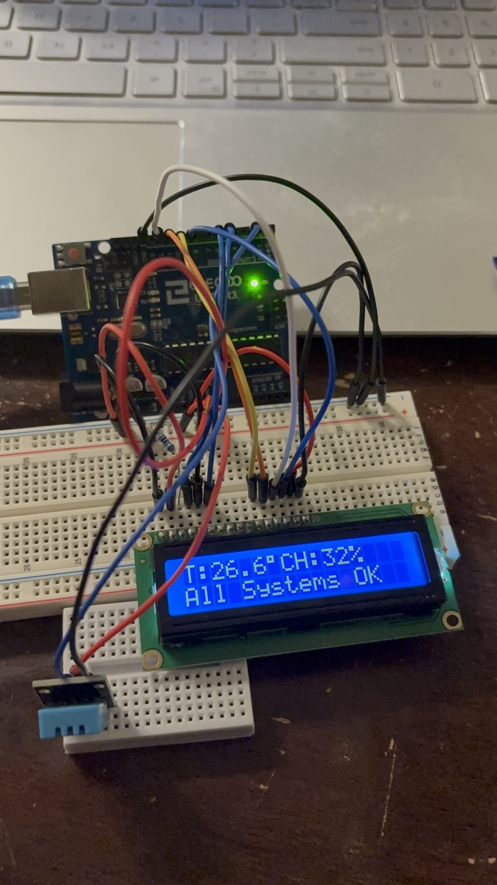
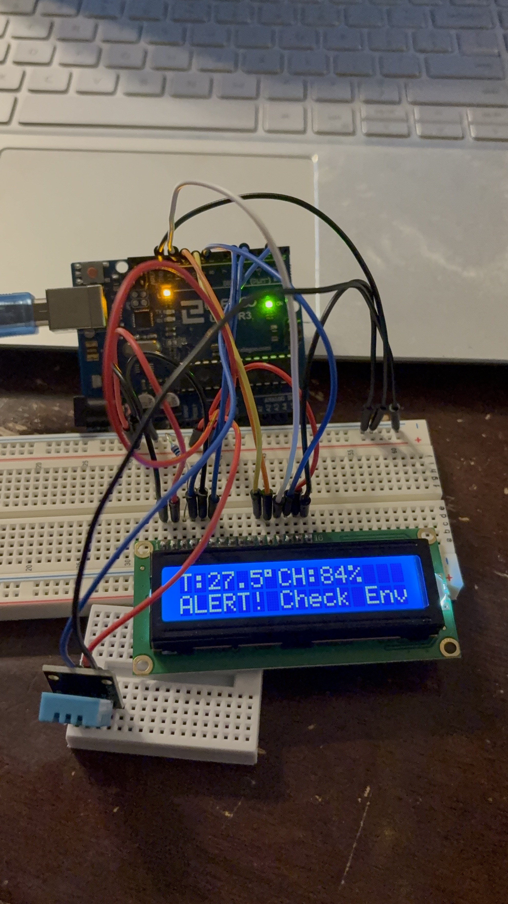

# AI-Powered Environmental Anomaly Detector for Gulfstream 550 Operations

## Overview

This project is a hybrid AI anomaly detector designed for use by Part 135 charter operators flying Gulfstream 550 aircraft. It continuously monitors cabin temperature and humidity, providing real-time alerts for abnormal environmental conditions that could impact safety, comfort, or sensitive equipment.

The system uses a DHT11 sensor for data collection, an AI-inspired adaptive algorithm for anomaly detection, and a 16x2 LCD for clear status display. It is optimized for rapid pre-flight checks and can be easily extended for broader operational use.

---
## System Screenshots



---

## Demo Videos

Videos demonstrating the system in action are stored in the `/media/` folder:

- [Humidity Spike Alert Demo](media/video_humidity_spike.mov)
- [Max Threshold Alert Demo](media/video_max_threshold.mov)

## Features

- Hybrid AI Detection  
  Combines adaptive learning (exponential smoothing and variance tracking) with absolute safety thresholds to catch both gradual drifts and sudden environmental anomalies.
- Rate-of-Change Alert  
  Instantly flags rapid humidity changes (e.g., 15% in 2 seconds), which may indicate leaks or equipment failures.
- Aviation-Grade Limits  
  Hard-coded upper and lower bounds for temperature and humidity, based on typical Gulfstream 550 operational recommendations.
- Visual and Physical Alerts  
  - LCD1602 displays live temperature, humidity, and system status.
  - Built-in LED (pin 13) lights up on any anomaly.
- Robust Serial Output  
  For diagnostics and logging.

---

## Hardware

- Arduino Uno R3
- DHT11 Temperature & Humidity Sensor
- LCD1602 16x2 Display (wired in 4-bit mode)
- (Optional) 5kΩ resistor for LCD contrast (V0 pin)
- Jumper wires

### Wiring Diagram

```
DHT11       Arduino
--------------------
VCC         5V
DATA        D2
GND         GND

LCD1602     Arduino
--------------------
VSS         GND
VDD         5V
V0          5kΩ resistor to GND
RS          D5
EN          D6
D4          D10
D5          D11
D6          D12
D7          D9
A (LED+)    5V (with 220Ω resistor)
K (LED-)    GND
```

---

## How It Works

1. Adaptive Baseline Learning  
   The system continuously updates its understanding of “normal” temperature and humidity using exponential smoothing.
2. Variance-Based Thresholds  
   It calculates dynamic thresholds (±3 standard deviations) to detect unusual deviations from the baseline.
3. Absolute Limits  
   If readings ever exceed aviation-recommended minmax values, an alert is triggered immediately.
4. Rate-of-Change Detection  
   If humidity changes more than 15% in a single reading, the system flags this as an anomaly.
5. User Feedback  
   - The LCD displays current readings and status “All Systems OK” or “ALERT! Check Env”.
   - The LED provides a physical alert for quick recognition.

---

## Example Use Cases

- Pre-flight cabin checks Quickly verify that environmental conditions are within safe limits before passenger boarding.
- Equipment bay monitoring Detect leaks or failures that could cause rapid humidity changes.
- Operational safety Prevents dispatch with unsafe or unknown cabin conditions.

---

## Future Improvements

- Edge Impulse Integration  
  With more capable hardware (e.g., ESP32), deploy advanced ML models for predictive maintenance and multi-sensor fusion.
- Remote Crew Notifications  
  Integrate SMSemail alerts for off-aircraft crew.
- Data Logging  
  Add SD card or cloud logging for audit trails and trend analysis.

---

## How to Run

1. Connect the hardware as shown above.
2. Upload the provided Arduino sketch.
3. Power on the system. The LCD will display live readings and alert status.
4. Trigger an alert by exceeding the set temperaturehumidity limits or rapidly changing humidity.

---

## Author

Nathan (Software Engineering Intern Application)  
May 2025

---

Thank you for reviewing my submission!  
I welcome any feedback or questions about the implementation or design choices.
